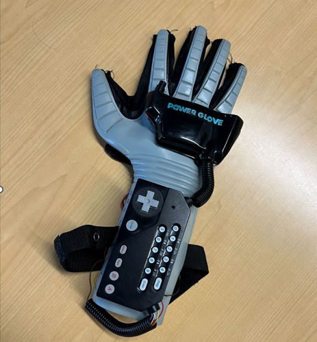

# TAMU CSCE Capstone 2025 - Powerglove

# Demo Video
Click image below to watch

# Project google drive folder
https://drive.google.com/drive/folders/1QBTlvf5KhOVl-Dzjxu-7hFhMazjApdm0?usp=sharing

# Arduino IDE Setup
https://learn.adafruit.com/adafruit-feather-sense/arduino-support-setup

Follow steps below depending on OS

# For Windows and Linux

1. Download Arduino IDE at https://www.arduino.cc/en/Main/Software
2. Start Arduino IDE and go to preference and add https://adafruit.github.io/arduino-board-index/package_adafruit_index.json as an 'Additional Board Manager URL'
3. Restart the IDE
4. Open Board Manager in the Tools -> Board and install 'Adafruit nRF52 by Adafruit'
5. After install use Tools -> Board to select Adafruit Feather nRF52840 Sense 

# For Windows Only

Windows Users will likely need to install the following two links
Select all options when installing below
https://learn.adafruit.com/adafruit-arduino-ide-setup/windows-driver-installation
CP210x Windows Drivers option is what I had to choose
https://www.silabs.com/developer-tools/usb-to-uart-bridge-vcp-drivers?tab=downloads

# For Linux Only 

Follow above windows steps and then follow below if python3 is not installed already

Linux Users will likely need to install https://www.silabs.com/developer-tools/usb-to-uart-bridge-vcp-drivers

1. Run `$ sudo apt-get install python3`
2. Run `$ pip3 install --user adafruit-nrfutil`
3. Add to path if needed
4. Ensure adafruit-nrfutil can be executed in terminal by running `$ adafruit-nrfutil version`

# Library Manager install requirements

On the left click of the Arduino IDE click the library manager(book icon) and install the following libraries. Names should be exact to name in library manager

Arduino_APDS9960
Arduino_LSM6DS3
Adafruit APDS9960 Library
Adafruit BMP280 Library
Adafruit BusIO
Adafruit LIS3MDL
Adafruit LSM6DS
Adafruit SHT31 Library
Adafruit Si7021 Library
Adafruit Unified Sensor
LSM6

# How to run on Arduino IDE

After steps above plug in the Adafruit Feather nRF52840 Sense and Upload your code with the Arduino IDE.

Ensure COMM port is correct for the connection to the board.

## Debug
If updating the board user might need to open up glove and click the button on the board to update what it runs.

# Git Commands

## Branching

When developing locally, a new branch should be created so that you will able to develop without disturbing the main branch. 

Commands:

1. `git branch <branch-name>` - Create branch

2. `git checkout <branch-name>` - Switch to branch

## Commits and Pushing to Remote

When developing, you need to save your changes. Commits let you save changes in the repository. Pushing changes to remote sends a backup of your changes to the central repository. Although you can create as many commits as you'd like it is best to make good commits. This can be characterized by adequately describing what changes have been made as well as only making commits after significant additions, not every line of code

Creating Commits:

1. Get current changes:

    `git status`

2. Add necessary files:

   `git add <file-name>` - Adding one file

   `git add .` - Adding all files in your current directory

4. Committing changes:

    `git commit -m <commit message>` - Make a commit with a short commit message.

    `git commit` - Make a commit with a long commit message (Opens a text editor).
